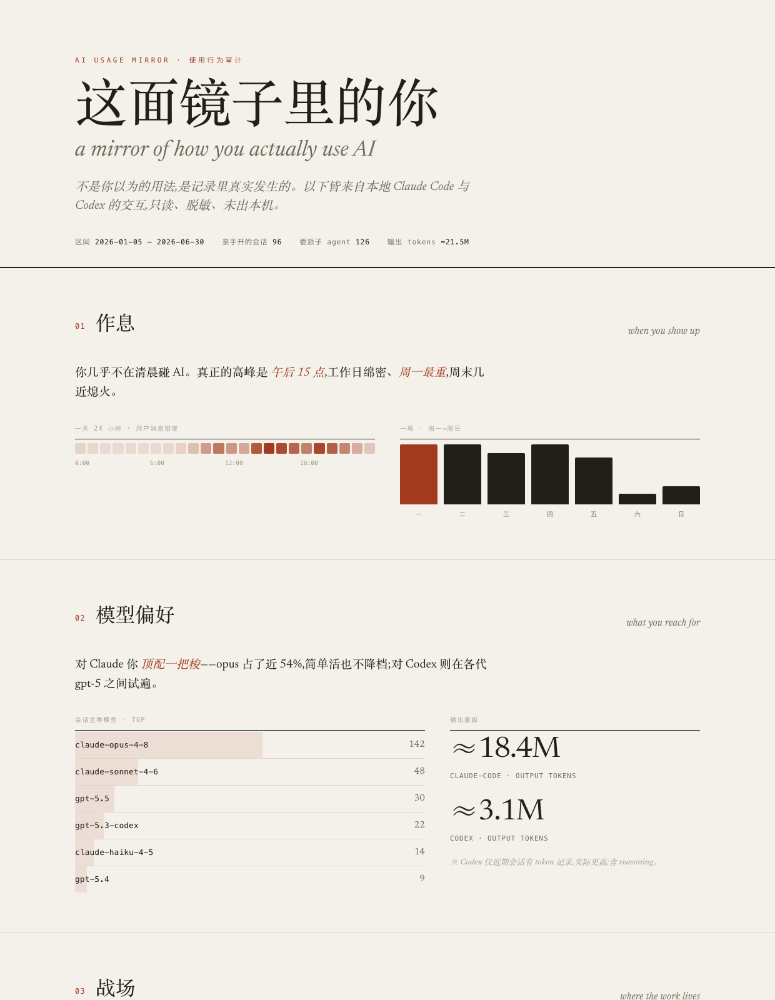

# ai-usage-mirror

**A mirror for how you *actually* use AI.** A [Claude Code](https://docs.claude.com/en/docs/claude-code) skill (also runnable as a plain CLI) that reads your local AI‑assistant transcripts, normalizes them into SQLite, and produces an honest audit of your usage habits — your rhythm, your go‑to models, the projects you live in, the commands in your muscle memory, the things you keep correcting, and the tasks you do over and over.

It captures **what you did, not what you said** — and then renders it as a quiet, editorial report page that opens itself when the audit finishes.

> Not a real‑time dashboard. A retrospective, local‑only *quantified‑self for AI usage*.



<sub>Preview rendered from synthetic sample data.</sub>

---

## Why

You use AI dozens of times a day and have almost no idea what that adds up to. Which model do you actually reach for? When are you most productive? What do you keep re‑explaining? What do you spend correction rounds on — and could you front‑load it into your prompts?

`ai-usage-mirror` answers those from your real transcripts, not your self‑image.

## What it reads (v1)

| Source | Location | Format |
|---|---|---|
| **Claude Code** | `~/.claude/projects/**/*.jsonl` | JSONL, one file per session |
| **Codex** | `~/.codex/sessions/**/*.jsonl` | JSONL rollout files |

> Desktop chat apps (ChatGPT / Claude desktop) keep conversations server‑side or in IndexedDB and are **out of scope** — the skill only covers assistants that leave structured local records. New sources are one parser module away (see `scripts/sources/`).

## Privacy

- **Read‑only** on your transcripts — it never writes to `~/.claude/projects` or `~/.codex`.
- Secrets / emails / home paths are **redacted before anything is persisted**.
- Everything stays local. **Zero network, zero telemetry, zero upload.** (The only optional network is an opt‑in embedding‑model download for semantic clustering.)
- The SQLite store, digest, and rendered report live under `.state/` and are git‑ignored.

## Install

Drop the folder into your skills directory (Claude Code auto‑discovers it):

```bash
git clone https://github.com/Lazarus893/ai-usage-mirror ~/.claude/skills/ai-usage-mirror
```

No dependencies — pure Python 3 standard library (SQLite + FTS5 ship with Python). Optional semantic clustering wants `pip install fastembed`.

## Use

**As a skill:** just say *"analyze my AI usage habits" / "复盘我怎么用 AI"* — it runs the pipeline and the report page opens automatically.

**As a CLI:**

```bash
cd ~/.claude/skills/ai-usage-mirror
python3 scripts/mirror.py triage        # readiness check + next_command
python3 scripts/mirror.py ingest        # parse sources into SQLite (incremental, ~0.02s warm)
python3 scripts/mirror.py digest --json # the compact aggregate the report is built from
python3 scripts/mirror.py cluster --json# recurring task-type clusters
python3 scripts/mirror.py report        # render the report page and open it
python3 scripts/mirror.py profile       # distill your coding-habit profile to markdown
python3 scripts/export_input_profile.py # distill a context artifact for the Handy input method
```

The whole pipeline runs in ~2s cold over hundreds of MB of transcripts, and the digest that summarizes it all is ~30 KB.

## Coding-habit profile

Beyond *how* you use AI, `mirror profile` distills *what kind of coder you are* into a two‑tier markdown (`.state/coding-profile.md`), borrowing a MECE category‑tree method: a small set of orthogonal habit dimensions, with tool/model/project kept as cross‑cutting slicers rather than dimensions.

- **Tier A — fingerprint (descriptive):** your **stack** (packages the AI actually installed for you, libraries you name in prompts, package managers, languages), **prompting style** (instruction length mix, acceptance‑criteria rate, discuss‑first tendency), **verification discipline** (test / git / typecheck / build command mix, test‑to‑edit ratio), and your recurring task archetypes.
- **Tier B — memory‑ready candidate rules (prescriptive):** the frictions you hit *repeatedly*, themed and turned into front‑loadable rules you can paste into your own memory or agent instructions — suggestive, not accusatory.

`mirror profile --json` emits the deterministic summary for an LLM to synthesize the enriched write‑up; plain `mirror profile` renders a deterministic baseline itself. Extraction adds one column (`tool_call.pkgs`) — bump to schema v2, auto‑migrated via `ingest --full`.

## Feeding it into an input method (Handy bridge)

The mirror can also distill your usage history into a small **context artifact** for a local voice input method ([Handy](https://github.com/cjpais/Handy) / 元宝输入法), so speech‑to‑text and prompt refinement inherit *your* vocabulary and engineering priors instead of generic defaults. Separation of concerns: the mirror **exports**, the input method **imports** — neither reaches into the other.

```bash
python3 scripts/export_input_profile.py   # writes .state/input_profile.json (schema yuanbao-input-profile/v2)
```

Deterministic, read‑only, offline. It reads the existing `digest.json` (+ `mirror.db` when present; `--no-db` degrades gracefully) and splits into two native channels:

- **`terms`** — high‑frequency domain proper nouns (project names, CamelCase libraries, acronyms, hot CJK words) → the input method's **dictionary hotwords**, improving ASR/refinement on names you actually use. A literal‑hit channel; kept conservative (precision over recall).
- **`facts`** — structured personal memory (`topic` + `fact`): your **stack** (grouped frontend / editor / data‑backend / testing / AI‑agent / desktop‑infra), **languages**, **projects**, and **collaboration style** → the input method's **memory facts**, giving refinement and the agent a *data‑backed* engineering prior. Confidence thresholds split by source — a package the AI actually **installed** counts at ≥1, a library only **mentioned** in prompts needs ≥2. Capped at ≤14 to leave room for your own memories.
- **`topics`** — v1 legacy project‑share sentences, kept only for backward compatibility; ignored when `facts` are present.

On the input‑method side the artifact lands at a fixed path, so import is zero‑config: it **auto‑imports on startup** whenever the artifact's mtime has advanced past the last import (idempotent, and it won't fight your later manual edits), with a manual "import now" button as the other lane. Net loop: **run the export → next launch ingests it, no clicks.**

## The report

The audit renders as a single self‑contained HTML page — an *editorial audit* rather than a dashboard: warm paper, one restrained accent, serif display + mono data, no gradient/emoji/icon slop. Its centerpiece is the **friction** section, which quotes your own corrections back to you, grouped by theme.

Seven sections: rhythm · model preference · projects · muscle memory (commands & file types) · friction · recurring tasks · reflections.

## How it works

A four‑layer pipeline where **scripts do the deterministic work and the LLM does the judgment**:

```
Discover → Extract (normalize) → Store (SQLite = source of truth) → Aggregate (digest) → Report
                                        └→ Index (FTS5 + optional embeddings) → search / pack / cluster
```

- **SQLite is the single source of truth**; the digest, search index, and vectors are derived assets rebuilt from it (fail‑open).
- **Incremental** ingest by `(mtime, size, hash)` — only changed sessions re‑parse.
- Sessions are classified `real` (you), `meta` (delegated sub‑agents), or `artifact` (TUI slash‑command noise) so engagement metrics stay honest while delegated work still counts toward tooling stats.
- A **robot‑mode CLI** (`triage` / `doctor` / `capabilities`, JSON out, semantic exit codes) makes it self‑driving for an agent.

Full design in [`ARCHITECTURE.md`](ARCHITECTURE.md).

## Honesty notes

This tool tries not to lie about its own limits: temporal stats count only your direct messages (sub‑agents' overnight runs don't); Codex token counts are partial (only recent sessions log them); a few task clusters may be spurious lexical merges. These caveats ship inside the digest's own `meta`.

## Credits

The extract/normalize/search architecture was informed by studying [CASS](https://github.com/Dicklesworthstone/coding_agent_session_search) (unified local agent‑session search), [Suvadu](https://github.com/AppachiTech/suvadu) (executor‑aware shell history), and Engram (behavioral memory for Claude Code).

## License

MIT
